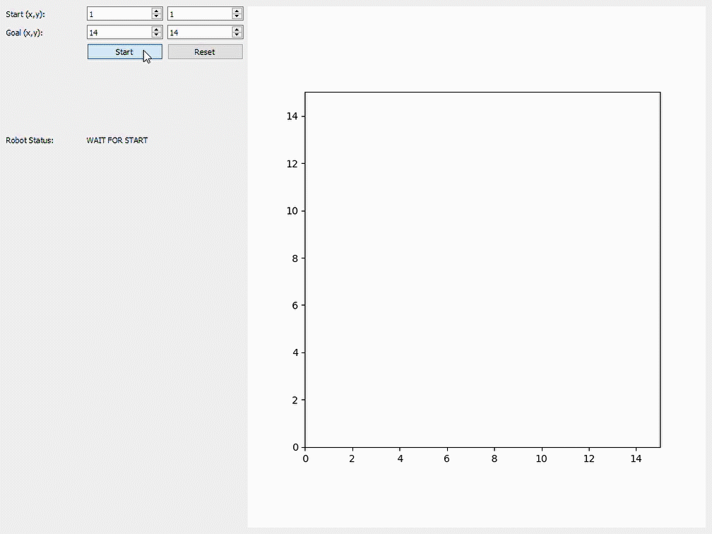
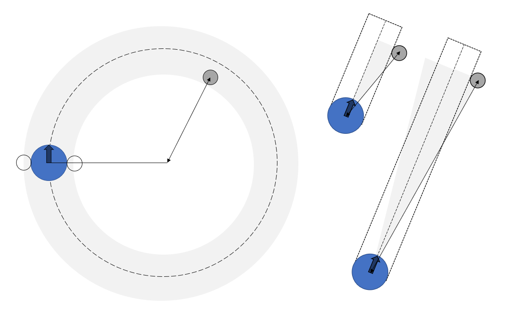

# Visualization of the Dynamic Window Approach
Interview assignment in the application process for the role of Robotics Engineer at JetBrains Techlab. 
Visualization of the Dynamic Window Approach path planning algorithm. 

## Visualization



## Algorithm Implementation
The implementation of the algorithm is heavily based on the paper of Fox et al. (1997), all functions for the algorithm 
are defined in [dwa.py](/dwa.py). The visualization and user interface are defined in [dwa_viz.py](/dwa_viz.py). 
All parameters can be set in the [configuration file](/config.yaml). 

1. ```dynamic_window(bot)```
    
    In the dynamic window approach the search space for velocity commands is reduced 
by the dynamic constraints of the robot. The minimal and maximal velocity commands are 
thus limited by the robots current velocity and its maximum acceleration/deceleration capabilities. 

2. ```admissible_paths(bot, window, obstacles)```

    Paths are determined by pairs (v, omega) of translational and rotational velocities. 
    A path is considered admissible if the robot is able to stop before it reaches the closest
    obstacle on the corresponding path. 
    
3. ```find_optimum(bot, paths, goal_pos, p)```

    Three criteria are considered for selecting the optimal path. 
    
    1. _Target Heading:_ a measure of progress towards the goal location.
     
        To consider the dynamics of the rotation, the bot heading is computed at the position which the robot 
        will reach when exerting maximal deceleration after the next time interval. 
        The target heading is maximal when the robot heading is aligned with the goal heading. 
        
    2. _Clearance:_ the distance to the closest obstacle on the path.
    
        If there is no obstacle on the path this value is set to a large constant. 
        
    3. _Velocity:_ projection of the translational velocity v
    
    All three factors are normalized to [0,1] and multiplied with a gain. 
    The sum of the three factors is maximized to find the optimal path. 
    
 1. ``` bot.update_state(v, omega)```
 
    The robot state is updated based on the optimal velocity inputs. 
 
 1. This process is repeated until the robot has reached the goal location. 

#### Collision Detection
On a curved path the center-to-center distance of the path and obstacle is compared to the grey collision area. 
On a straight path a collision is detected if the angle between the obstacle and the robot falls between some angle 
(depending on the distance) around the robot's heading. 

When the distance to the obstacle is greater than the breaking distance of the robot, the path is marked as safe.

_Graphical representation as an aid to understand the collision detection_


## Possible improvements?
- Test more (edge) cases and test with different parameters. 
- Add an extra margin around obstacles to avoid collision. 
- Normalize the values based on the minimal and maximal values of the admissible paths of that time interval.
- Adjust grid visualization to robot position
- _Known Issue:_ Sometimes spiraling into obstacles after collision.


## References
D. Fox, W. Burgard and S. Thrun, "The dynamic window approach to collision avoidance," 
in _IEEE Robotics & Automation Magazine_, vol. 4, no. 1, pp. 23-33, March 1997

DOI: [10.1109/100.580977](https://ieeexplore.ieee.org/document/580977)
